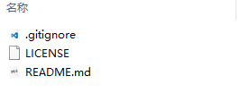
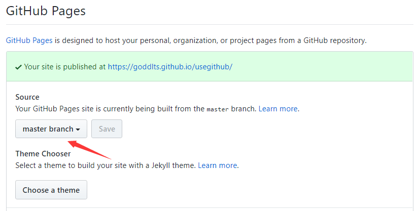

# Github的使用

## Connecting to GitHub with SSH

https://help.github.com/articles/testing-your-ssh-connection/

## 设置账号和EMail

- 本地设置

```bash
$ git config user.name "John Doe"
$ git config user.email johndoe@example.com
```

本地设置的账号和密码存储在 .git/config中

- 全局设置

```bash
$ git config --global user.name "John Doe"
$ git config --global user.email johndoe@example.com
```

全局设置的账号和密码存储在系统目录中

## 新建一个仓储

- 服务端新建一个仓储

  

- 本地初始化git

  - 一般git目录会有三个文件

    

  - 初始化的命令

    ```bash
    // 初始化.git文件夹
    git init
    // 文件添加到暂存区
    git add .
    // 提交到本地仓储
    git commit -m 'init'
    // 设置origin
    git remote add origin 'git@github.com:goddlts/usegithub.git'
    // 提交到服务器的仓储的master分支
    git push origin master
    ```

## 代码版本还原

- 查看所有版本

```bash
$ git log
```

- 还原到指定版本

```bash
$ git reset --hard 1cce3c1e6e20ffc86e5fb2b7d5
```

## 分支操作

```bash
查看当前分支
	$ git branch 
新建分支
	$ git branch dev
切换分支
	$ git checkout dev
合并分支(当前分支是master，把dev合并到master)
	$ git merge dev
新建和切换分支
	$ git checkout -b dev  
	相当于两条命令
	$ git branch dev
	$ git checkout dev
删除分支
	$ git branch -d dev
```


## 常用操作

- clone

从服务器克隆代码

```bash
git clone https://github.com/xxx
```

- pull

获取最新代码

```bash
git pull
```

## Github Pages!

- 新建一个仓储，名字必须指定为 username.github.io

  - 例如：goddlts.github.io

- 上传一个静态页面即可
- 在仓储的设置中 

  

- 然后在当前仓储中放置一个index.html既可以通过username.github.io/仓储名称   访问
  - 例如：goddlts.github.io/usegithub